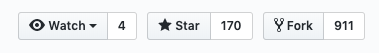

# idg1100-2019-groups
Public repo for maintaining the groups for the final project.

This repo will be used to practice how to fork a project and eventually create a pull request.

Forks are used to either propose changes to someone else's project or to use someone else's project as a starting point for your own idea.

# Fork this project

1. On GitHub, navigate to the idg1100-2019-groups](https://github.com/carlosvicient/idg1100-2019-groups) repository.

1. In the top-right corner of the page, click Fork.



## Create a local fork of your fork

1. Open the forked repository in your GitHub and copy the url for cloning the project


## Config the local repo

You will need to config the directories that contain the location of the fork you cloned.

1. Type `git remote -v` (you should see 2 lines with the `fetch` and `push`repositories pointing to your forked repo

1. Type `git remote add upstream`, and then paste the same URL you copied when cloning the project. It will look like this:

    `$ git remote add upstream https://github.com/carlosvicient/idg1100-2019-groups.git`

1. To verify the new upstream is correct, type again `git remote -v. You should see now 4 different urls (2 poinint to your forked repo and 2 poinint to the origianl repo)

# Edit the project

In your local repo, open your text editor and edit the file `index.html`

`````
<h2>Group#1</h2>
<ul>
    <li></li>
    <li></li>
    <li></li>
    <li></li>
    <li></li>
</ul>
<p>
    The group leader of this group is:
    <span></span>
</p>
`````

1. Find your group number

1. Find the list item that will contain your name (sorted alphabetically by last name. You have to only add your name in the list)

1. Save the changes `git commit`

1. Push the changes `git push`

# Creating a Pull Request

Read the following article: [sync your fork with the upstream repository](https://help.github.com/en/github/collaborating-with-issues-and-pull-requests/syncing-a-fork)